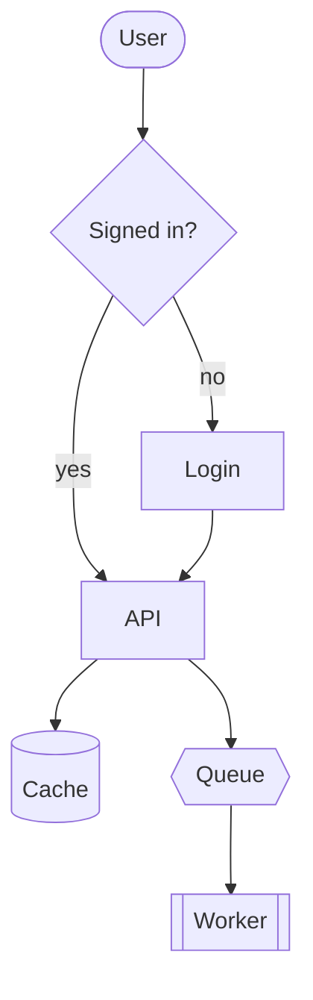

How a request moves through the service:

```mermaid
flowchart TD
  U([User]) --> G{Signed in?}
  G -->|yes| A[API]
  G -->|no| L[Login]
  L --> A
  A --> C[(Cache)]
  A --> Q{{Queue}}
  Q --> W[[Worker]]
```

