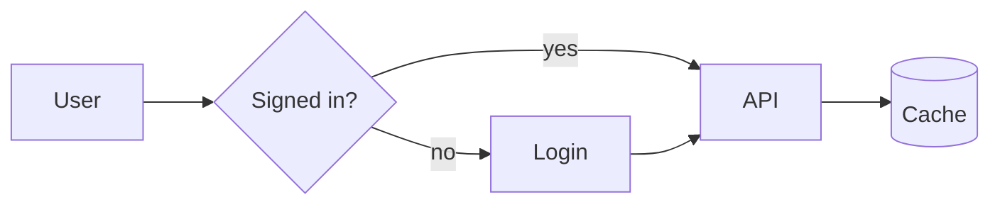

Here is how a request moves through the service:

```mermaid
flowchart LR
  U[User] --> G{Signed in?}
  G -->|yes| A[API]
  G -->|no| L[Login]
  L --> A
  A --> D[(Cache)]
```

The login page sends the user back to the API once they sign in.
